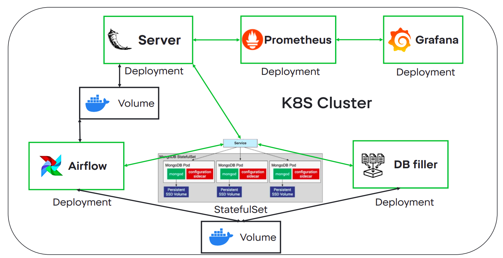
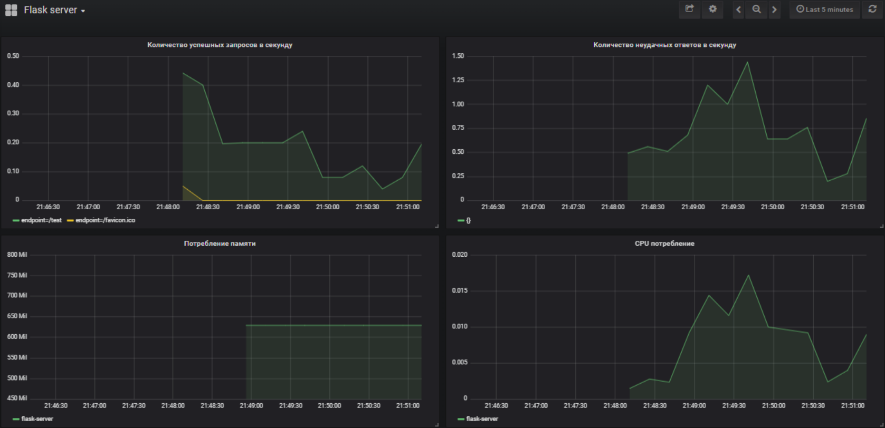
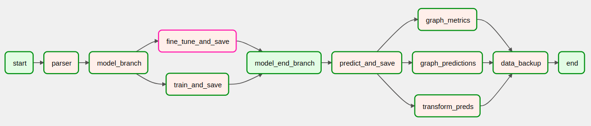
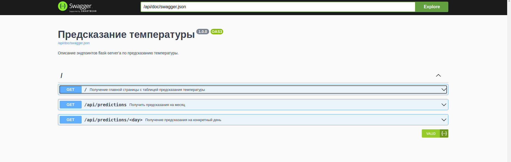

# Сервис по прогнозу температуры в г. Москва

## Description
Данный сервис позволяет предсказывать погоду, используя исторические данные, которые
в свою очередь берутся из [Gismeteo](https://www.gismeteo.ru/diary/4368/2023/1/).

## Architecture


Компоненты, из которых состоит проект:
- Mongo DB (database)
- Database filler
- Web-Server
- Airflow
- Prometheus
- Grafana

Все эти компоненты разворачиваются в `kubernetes` кластере.

## Local usage

Для сборки и запуска приложения можно использовать зависимости из `requirements.txt` либо же поднять инфраструктуру,
используя `docker-compose`.

```
cd dmls
docker-compose up -d
```
Запустятся 6 следующих контейнеров:
* database
    - База данных на mongo
* database_filler
    - Заполняет БД на старте данными из [data/](./data) и завершает работу
* pipeline
    - Запускает airflow, настроенный на запуск пайплайна раз в сутки для обновления погоды
* server
    - С помощью flask рендерит html страницы
    - Отвечает на API запросы
* prometheus
    - Собирает метрики с flask сервера, через `/metrics` эндпоинт
* grafana
    - Отображает графики, собранные с помощью `prometheus`

## Monitoring

Для мониторинга состояния вебсервера, содержащего эндпоинты для работы с ML-моделью,
используется связка `prometheus` и `grafana`. Когда проект запущен, можно перейти на 
`localhost:3000`



## Stages of pipeline
1. **Парсинг**<br>
  Парсинг температуры за новый день. Дается 3 попытки с переодичностью в 30 минут. На 4 попытку происходит дублирование температуры за последний день.
2. **Обучение**<br>
  В первый раз модель обучается с нуля, и сохраняются ее веса. <br>
  Далее модель просто дообучается на данных за новый день.
3. **Прогноз**<br>
  Модель делает прогноз на 7 дней вперед и необходимое сохраняется в БД
4. **Формирование контента для сервера**<br>
  Постобработка прогнозов, построение таблиц и графиков.
5. **Бэкап данных**<br>
  Сохранение таблиц БД с историей прогнозов в csv на случай падения контейнеров. 



## API 
Сервер поддерживает следующие запросы:
* /api/predictions - получить прогноз погоды на все 7 дней вперед
* /api/predictions/&lt;day&gt; - получить прогноз погоды на заданный &lt;day&gt;
* /api/metrics - получить все доступные метрики на последнюю дату
* /api/model - получить используемую модель

Также имеется `Swagger`, соответственно при необходимости можно
перейти на `server/api/doc` и ознакомиться с эндпоинтами.




## GitLab CI
В Gitlab Container Registry загружен образ Ubuntu 22.04 со всеми предустановленными зависимостями.<br>
При изменениях в репозитории на локальном Runner разворачивается данный образ с дополнительным сервисом mongo и выполняются следующие тесты:<br>
* Пайплайн: [tests/](./tests)
* API: [test_api.py](./server/test_api.py)


## Data Scraping
Для обучения модели в автоматическом режиме были собраны данные погоды с сайта [gismeteo](https://www.gismeteo.ru/diary/4368/2023/1)<br>
Код: [scraper/](./scraper)


## Project Structure
* [data/](./data)
* [database_filler/](./database_filler)
  * [Dockerfile](./database_filler/Dockerfile)
  * [filler.py](./database_filler/filler.py)
* [infra/](./infra)
  * [metrics/](./infra/metrics)
    * [grafana/](./infra/metrics/grafana)
    * [docker-compose.yml](./infra/metrics/docker-compose.yml)
    * [prometheus.yml](./infra/metrics/prometheus.yml)
* [k8s-files/](./k8s-files)
* [pipeline/](./pipeline)
  * [dags/](./pipeline/dags)
    * [operators/](./pipeline/dags/operators)
    * [pipeline.py](./pipeline/dags/pipeline.py)
  * [Dockerfile](./pipeline/Dockerfile)
  * [requirements.txt](./pipeline/requirements.txt)
* [scraper/](./scraper)
  * [parser.py](./scraper/parser.py)
* [server/](./server)
  * [static/](./server/static)
  * [templates/](./server/templates)
  * [Dockerfile](./server/Dockerfile)
  * [requirements.txt](./server/requirements.txt)
  * [server.py](./server/server.py)
  * [swagger-config.yaml](./server/swagger-config.yaml)
  * [test_api.py](./server/test_api.py)
  * [tools.py](./server/tools.py)
* [tests/](./tests)
* [.gitignore](./.gitignore)
* [.gitlab-ci.yml](./.gitlab-ci.yml)
* [README.md](./README.md)
* [docker-compose.yml](./docker-compose.yml)
* [pytest.ini](./pytest.ini)
* [requirements.txt](./requirements.txt)
